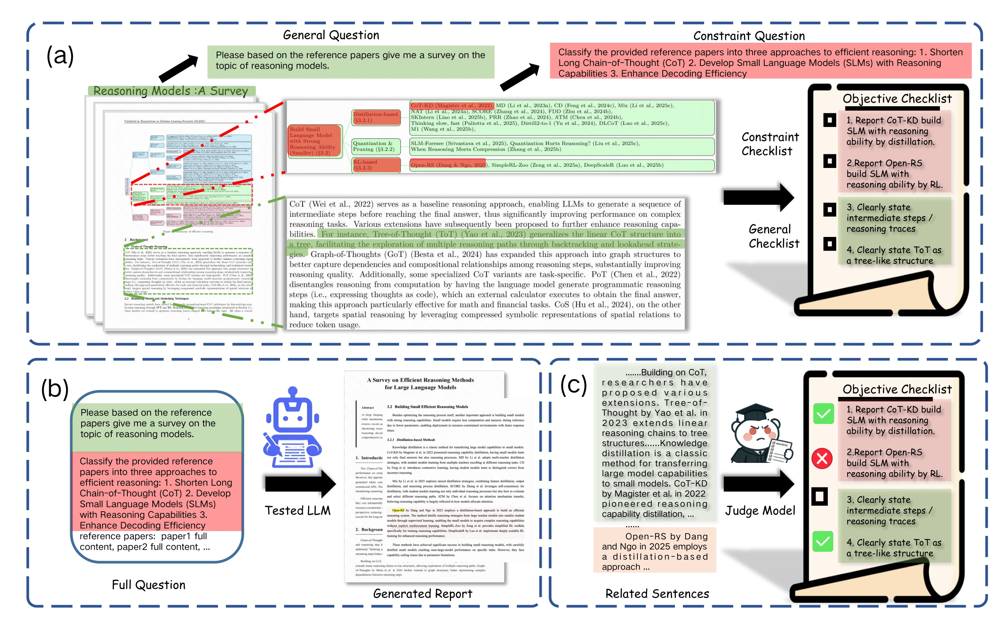

<div align="center">

# DeepSynth-Eval: Objectively Evaluating Information Consolidation in Deep Survey Writing

**Hongzhi Zhang**<sup>†\*</sup>, **Yuanze Hu**<sup>‡\*</sup>, **Tinghai Zhang**<sup>†\*</sup>, **Jia Fu**<sup>†\*</sup>, **Tao Wang**<sup>†\*</sup>,
<br>
**Junwei Jing**<sup>†</sup>, **Zhaoxin Fan**<sup>‡</sup>, **Qi Wang**<sup>†</sup>, **Ruiming Tang**<sup>†✉</sup>, **Han Li**<sup>†</sup>, **Guorui Zhou**<sup>†</sup>, **Kun Gai**<sup>†</sup>

<sup>†</sup>Kuaishou Technology &nbsp;&nbsp; <sup>‡</sup>Beijing Advanced Innovation Center for Future Blockchain and Privacy Computing

<sup>\*</sup>Equal Contribution &nbsp;&nbsp;&nbsp;&nbsp; <sup>✉</sup>Corresponding Author: [tangruiming@kuaishou.com](mailto:tangruiming@kuaishou.com)

[](https://arxiv.org/pdf/2601.03540)
[](https://github.com/Kwai-Klear/DeepSynth-Eval)


</div>

---

 *Figure 1: An illustration of DeepSynth-Eval. (a) From a reference survey, we derive a general prompt and constraint questions, and construct corresponding general/constraint checklists for evaluation. (b) The full question (prompt + constraints + reference papers) is fed to a tested LLM to generate a report. (c) A judge model verifies each checklist item on the generated report, converting subjective synthesis evaluation into objective item-wise verification.*

DeepSynth-Eval is a benchmark and evaluation toolkit for **deep survey writing**. Instead of judging a survey only by style or a single holistic score, DeepSynth-Eval decomposes survey quality into a large checklist of verifiable knowledge requirements and uses an LLM judge to assess whether each requirement is:

- `mentioned_correct`
- `not_mentioned`
- `mentioned_incorrect`

This repository contains the **released benchmark data**, **evaluation pipeline**, and **scoring code** used to measure how well a system consolidates information from a paper collection into a survey-quality report.

## News

- [2026/04/04] Released the dataset and evaluation code.
- [2026/01/07] Released the paper on [arXiv](https://arxiv.org/pdf/2601.03540).

## Overview

DeepSynth-Eval is designed for the setting described in the paper: given a set of papers for a survey topic, a model or agent should synthesize a survey article that is both broadly comprehensive and able to satisfy concrete, high-value constraints.

The benchmark therefore separates evaluation into two complementary parts:

- **General groups**: broad topical coverage expected from a good survey.
- **Constraint groups**: stricter requirements tied to focused questions, tables, taxonomies, comparisons, or structured summaries.

The released benchmark file `data/DeepSynth-Eval_tasks.jsonl` contains:

- `96` survey-writing tasks
- `978` general checklist groups
- `249` constraint checklist groups
- `5,974` checklist subgroups
- `19,167` atomic requirements

Each task is anchored by a real survey paper identifier (`survey_id`) and a corresponding `general_prompt`. Constraint groups additionally include a `detailed_prompt` describing a focused synthesis objective.

## Repository Layout

```text
DeepSynth-Eval/
├── data/
│   ├── DeepSynth-Eval_tasks.jsonl     # benchmark tasks and checklist annotations
│   └── example_gen_result.jsonl       # example model output file
├── deepsynth_eval/
│   └── eval/
│       ├── evaluate.py                # LLM-as-a-judge checklist evaluation pipeline
│       ├── score.py                   # score aggregation and summary metrics
│       └── schemas.py                 # task/checklist data schema
└── recipes/
    └── eval_and_score.sh              # one-command evaluation recipe
```

## Task Format

Each task contains:

- `task_id`: unique task identifier
- `survey_id`: the source survey paper identifier
- `general_prompt`: the general survey-writing instruction
- `checklist`: a list of checklist groups

Each checklist group contains:

- `group_name`: topic or constraint name
- `strict`: whether the group is treated as a constraint group
- `detailed_prompt`: focused synthesis instruction for strict groups
- `sub_groups`: finer-grained requirement clusters
- `weight`: group weight in final score aggregation
- `clip_factor`: score normalization factor used during scoring

Each subgroup contains:

- `sub_group_name`
- `requirements`: a list of atomic checklist items, each with `content` and `reward`
- `eval_result`: populated by the evaluator

A minimal task shape looks like this:

```json
{
  "task_id": 0,
  "survey_id": "2209.06428",
  "general_prompt": "Please write a comprehensive survey paper ...",
  "checklist": [
    {
      "group_name": "Semantic Information Extraction Methods",
      "strict": false,
      "sub_groups": [...]
    },
    {
      "group_name": "Overview and comparison of common and state-of-the-art datasets",
      "strict": true,
      "detailed_prompt": "Construct a comprehensive table ...",
      "sub_groups": [...]
    }
  ]
}
```

## Preparing Generation Results

The benchmark file does not include generated surveys. You need to produce them yourself and write them into the `survey_result` field for each task.

Recommended workflow:

1. Read one task from `data/DeepSynth-Eval_tasks.jsonl`.
2. Use `survey_id` to locate the corresponding survey paper and collect its cited references as the source document set, following the paper's evaluation setting.
3. Use `general_prompt` as the main instruction for writing the survey.
4. For each strict checklist group, use `detailed_prompt` as an additional focused instruction when designing your prompting or agent workflow.
5. Save the generated survey text into `survey_result`.
6. Write all completed tasks back to a JSONL file.

You can use `data/example_gen_result.jsonl` as a reference for the expected file format.

## Installation

We recommend `python=3.10`.

```bash
pip install -e .
```

Core dependencies are declared in `pyproject.toml` and include:

- `litellm`
- `aiolimiter`
- `tenacity`
- `loguru`
- `tqdm`

## Judge Model Configuration

DeepSynth-Eval uses an LLM judge to verify checklist items. The evaluator calls the judge through `litellm`, so you can route requests to any LiteLLM-compatible model endpoint.

In `recipes/eval_and_score.sh`, configure:

| Parameter | Description |
| :-- | :-- |
| `judge_model_name` | Judge model name passed to LiteLLM |
| `judge_model_base` | Base URL of the judge endpoint; leave empty to use the default endpoint |
| `judge_model_kwargs` | Extra JSON-formatted model arguments |
| `judge_model_rpm` | Rate limit used by the async evaluator |

The evaluator uses `temperature=0.0` by default for more stable judgments.

## Running Evaluation

Run the end-to-end recipe:

```bash
bash recipes/eval_and_score.sh <task_name> /path/to/your_generation_result.jsonl
```

Example:

```bash
bash recipes/eval_and_score.sh gpt52_run data/example_gen_result.jsonl
```

The script performs two stages:

1. **Checklist evaluation**: `deepsynth_eval.eval.evaluate`
2. **Score aggregation**: `deepsynth_eval.eval.score`

## Output Files

After execution, the repository will create:

- `eval_results/`: per-task checklist judgments
- `score_results/`: per-task scores and final summaries
- `log/`: end-to-end run logs

`eval_results/*.jsonl` contains the original task data plus `eval_result` values for each subgroup.

`score_results/*.jsonl` contains the scored tasks plus an `evaluation_summary` with fields such as:

- `pass_rate_all`
- `pass_rate_general`
- `pass_rate_constraint`
- `mentioned_correct_cnt`
- `mentioned_incorrect_cnt`
- `not_mentioned_cnt`

## Scoring Protocol

The scoring logic is implemented in `deepsynth_eval/eval/score.py`.

For each requirement:

- `mentioned_correct`: add its reward
- `not_mentioned`: add `0`
- `mentioned_incorrect`: subtract its reward

For each checklist group:

- rewards are summed over all subgroups
- the group pass rate is computed as `reward_get / (clip_factor * reward_sum)`
- the group pass rate is clipped to a maximum of `1.0`

By default:

- general groups use `clip_factor = 1.0`
- strict groups typically use `clip_factor = 0.8`

This means strict groups can receive full credit once the generated survey satisfies enough of the weighted requirements, while still penalizing incorrect mentions.

Final reported metrics are macro-averaged across tasks:

- **Overall**: weighted average over all checklist groups
- **General**: weighted average over non-strict groups
- **Constraint**: weighted average over strict groups
- **Precision**: `mentioned_correct / (mentioned_correct + mentioned_incorrect)`

## Reported Results

Below are the main results reported in the paper. The paper reports using **DeepSeek-V3.2 (Thinking)** as the judge model.

| Workflow | Model | Overall | General | Constraint | Precision |
| --- | --- | ---: | ---: | ---: | ---: |
| - | Reference Survey | 96.1 | 95.5 | 98.9 | 99.6 |
| E2E Single-turn | Qwen3-30B-A3B-Thinking-2507 | 6.3 | 4.8 | 11.4 | 69.5 |
| E2E Single-turn | Qwen3-235B-A22B-Thinking-2507 | 24.8 | 24.7 | 23.3 | 79.9 |
| E2E Single-turn | DeepSeek-V3.2 | 23.4 | 22.2 | 27.0 | 79.8 |
| E2E Single-turn | GPT-5.2 | 28.3 | 26.4 | 36.1 | 85.5 |
| Agentic Multi-turn | Qwen3-30B-A3B-Thinking-2507 | 17.3 | 17.7 | 16.0 | 90.1 |
| Agentic Multi-turn | Qwen3-235B-A22B-Thinking-2507 | 35.5 | 37.5 | 27.5 | 92.9 |
| Agentic Multi-turn | DeepSeek-V3.2 | 30.4 | 31.4 | 27.0 | 91.4 |
| Agentic Multi-turn | GPT-5.2 | 33.3 | 34.8 | 26.2 | 95.3 |
| Agentic Multi-turn | GPT-5.2 (59/96 tasks subset) | 37.0 | 39.0 | 28.4 | 95.0 |

## Notes and Limitations

- The benchmark evaluates **information consolidation quality**, not writing style alone.
- The released pipeline assumes you can reconstruct the source paper collection for each survey topic.
- Final scores are sensitive to the choice of judge model because checklist verification is LLM-based.
- Constraint groups are intentionally demanding; satisfying the general prompt alone is usually insufficient.

## Citation

```bibtex
@article{zhang2026deepsyntheval,
  title={DeepSynth-Eval: Objectively Evaluating Information Consolidation in Deep Survey Writing},
  author={Zhang, Hongzhi and Hu, Yuanze and Zhang, Tinghai and Fu, Jia and Wang, Tao and Jing, Junwei and Fan, Zhaoxin and Wang, Qi and Tang, Ruiming and Li, Han and Zhou, Guorui and Gai, Kun},
  journal={arXiv preprint arXiv:2601.03540},
  year={2026}
}
```
